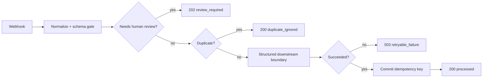

# IDRAH Tech — n8n Reliability & Infrastructure Proof

**Status:** self-owned engineering proof. Not client work. Not a production case study.

This small public-proof package demonstrates how I approach automation work when reliability, security boundaries and recoverability matter more than a happy-path demo.

## What is actually validated

The included n8n workflow was imported and executed on a real local n8n `2.36.9` instance with Node.js `24.20.0`.

Validated paths:
- normal event -> `processed` / HTTP 200
- duplicate successful event -> `duplicate_ignored` / HTTP 200
- incomplete event -> `review_required` / HTTP 202
- synthetic downstream failure -> `retryable_failure` / HTTP 503
- retry after failure -> `processed` / HTTP 200

The failure case does **not** commit the idempotency key, so a failed event can be retried safely.

## Workflow design

## Reliability properties

- explicit input normalization and validation
- human-review routing for incomplete/ambiguous input
- stable event IDs used as idempotency keys
- duplicate-safe reruns after successful completion
- idempotency commit only after downstream success
- retryable failures remain retryable
- bounded retained state
- credential-free workflow
- no external customer data or production writes

## Related infrastructure work

I also build security boundaries around self-owned Linux automation systems. The included infrastructure note shows a hardened systemd executor design using a dedicated service identity, `NoNewPrivileges`, filesystem allow-lists, empty capability sets, AppArmor/user-namespace mediation, network restriction, and resource limits.

That infrastructure work is **self-owned implementation work, not client VPS history**, and the executor sample is not presented as a completed production deployment.

## Files

- `workflow/reliability-sandbox-v0.1.json` — sanitized importable n8n workflow
- `VALIDATION.md` — exact runtime test evidence and limits
- `INFRASTRUCTURE.md` — sanitized Linux/systemd hardening implementation notes
- `tests/test_public_proof.py` — structural safety checks for the public workflow

## Claim boundary

What this proof supports:

> I built and runtime-validated a self-owned n8n reliability sandbox covering validation, duplicate-safe reruns, explicit failure handling and human-review routing, and I have implemented bounded Linux/systemd security controls in my own automation infrastructure.

What it does **not** support:
- prior client-production n8n deployments
- years of n8n experience
- battle-tested customer infrastructure claims
- claims that the included sandbox itself proves external API or LLM integrations

## Why this exists

The goal is not to publish a giant framework. It is to give a buyer one inspectable artifact that shows how I think about failure, retries, state, human review and security boundaries before touching real infrastructure.

— Hardi Reiljan, IDRAH Tech
